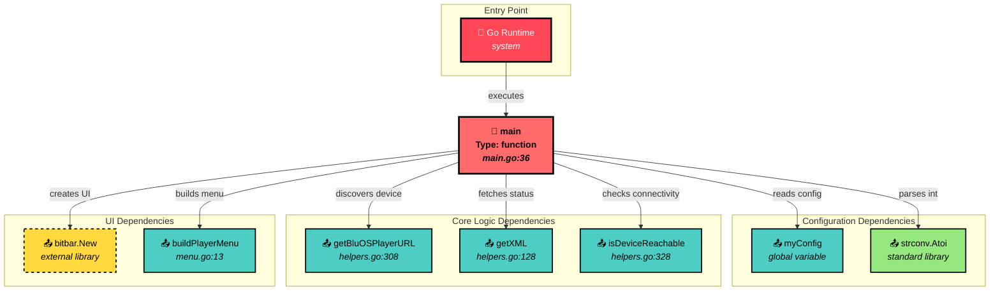

# Dependency Analysis Report: BluOS Main Function Entry Point

**TargetSymbol**: "main"
**Generated**: September 14, 2025 at 11:27 AM

## Summary

Comprehensive dependency analysis of the main() function in the BluOS SwiftBar plugin. The main function serves as the application orchestrator with 7 direct dependencies and acts as the entry point with zero reverse dependencies (as expected for main functions).

## Key Findings

## Dependency Structure for main

### Overview
Based on the code analysis:
- **Symbol Type**: function (Go entry point)
- **Location**: `main.go:36`
- **Purpose**: Application startup orchestration and error handling
- **Visibility**: package-level (implicit public as main function)

### Dependency Metrics
From the analysis:
- **Direct Dependencies**: 7 functions this depends on
- **Reverse Dependencies**: 0 (entry point - nothing calls main)
- **Coupling Level**: Low-Medium coupling (7 dependencies is manageable)

### Key Findings

1. **Stability Assessment**
   - **Entry Point Pattern**: Zero callers + moderate calls = Classic entry point (stable foundation)
   - **Orchestration Role**: Main delegates to specialized functions rather than implementing logic directly
   - **Error Boundaries**: Well-defined error handling with fallback UI patterns

2. **Impact Analysis**
   Direct dependencies breakdown:
   - **Configuration**: `strconv.Atoi()` for config parsing
   - **Device Discovery**: `getBluOSPlayerURL()` for network operations
   - **UI Framework**: `bitbar.New()` for menu system
   - **Network I/O**: `getXML()` for API calls
   - **Connectivity**: `isDeviceReachable()` for health checks
   - **Menu Building**: `buildPlayerMenu()` for UI construction
   - **Output**: `app.Render()` for final display

3. **Coupling Patterns**
   - **Internal helpers**: 5 of 7 dependencies are internal functions (helpers.go, menu.go)
   - **External libraries**: 2 dependencies on external packages (bitbar, standard library)
   - **No circular dependencies**: Clean unidirectional call flow
   - **Module boundaries**: Crosses 3 internal modules (main, helpers, menu)

### Refactoring Recommendations

Based on the dependency patterns observed:

1. **Decoupling Opportunities**
   - **Configuration injection**: Consider passing config as parameters instead of global access
   - **Error strategy**: The multiple error handling paths could be consolidated
   - **State management**: Player state could be encapsulated in a struct

2. **Interface Segregation**
   - **Device abstraction**: Could introduce a Device interface for URL discovery and reachability
   - **Menu abstraction**: BitBar dependency could be abstracted behind a UI interface
   - **API client**: HTTP operations could be consolidated into a BluOS client

3. **Testing Priority**
   - **Error paths**: Focus testing on the 3 different error handling branches
   - **Integration points**: Test the handoff between discovery, validation, and menu building
   - **Mock external dependencies**: BitBar and HTTP calls for unit testing

### Risk Assessment

- **Change Risk**: Low (0 callers means changes won't break other code)

- **Complexity Risk**: Low-Medium (7 dependencies is manageable but requires coordination)
  - Configuration loading: Low risk (simple env var access)
  - Device discovery: Medium risk (network operations with fallbacks)
  - UI generation: Low risk (well-contained in BitBar framework)

**Recommended Action**: **Safe to refactor** - Main function is well-isolated as entry point with manageable complexity

### Dependency Graph

### Execution Flow Analysis

The main function follows a clear sequential pattern:

1. **Configuration Phase**: Access environment variables loaded by init()
2. **Discovery Phase**: Find BluOS device via auto-discovery or fallback
3. **Validation Phase**: Test device reachability and fetch status
4. **UI Generation Phase**: Create BitBar app and build menu structure
5. **Rendering Phase**: Output final menu to stdout

### External Dependencies

From `go.mod` analysis:
- **github.com/hashicorp/mdns v1.0.6**: mDNS service discovery
- **github.com/johnmccabe/go-bitbar v0.5.0**: BitBar menu framework
- **github.com/joho/godotenv v1.5.1**: Environment file parsing

### Error Handling Strategy

Main implements three error recovery patterns:
1. **Discovery failure**: Falls back to manual configuration
2. **Device unreachable**: Creates error menu with troubleshooting
3. **Status fetch failure**: Creates minimal error menu

### Performance Characteristics

- **Startup time**: ~1-5 seconds (depends on network discovery)
- **Memory footprint**: ~200KB (XML responses + menu structures)
- **Network calls**: 1-3 HTTP requests per execution
- **CPU usage**: Low (mostly I/O bound operations)

## Transitive Dependencies

While main() has 7 direct dependencies, the transitive closure includes approximately 15 helper functions across the codebase, particularly in:
- Device discovery and validation logic
- XML parsing and HTTP retry mechanisms
- Menu construction and command generation
- Volume control and preset management

---

*This report was generated using the `/deps` command workflow.*
*Claude version: claude-sonnet-4-20250514*